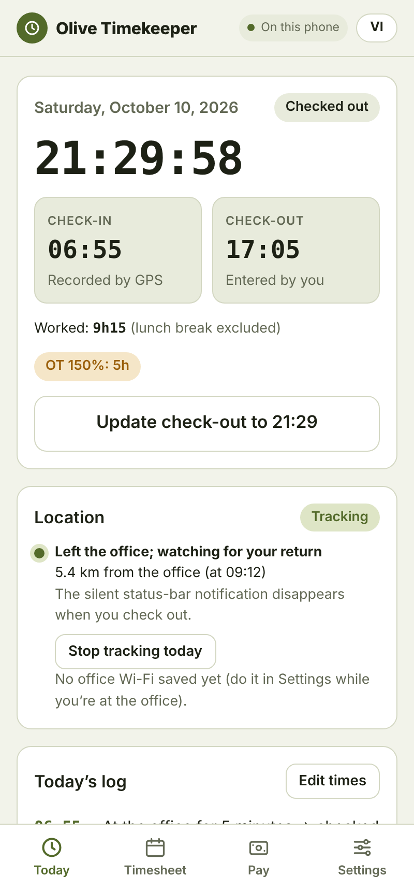
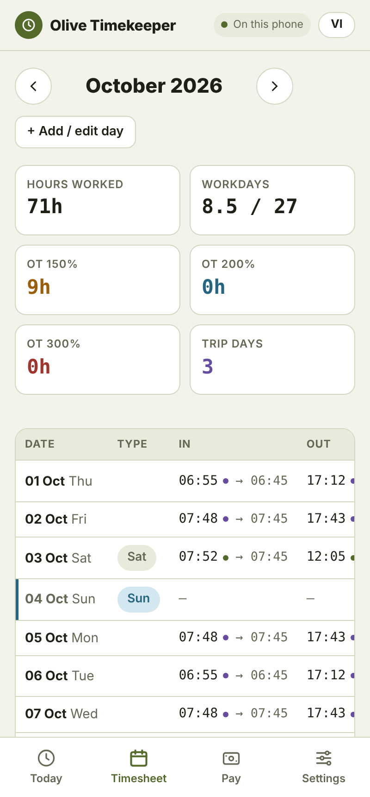
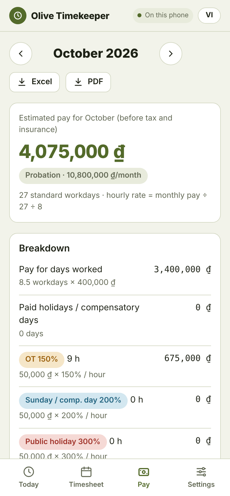
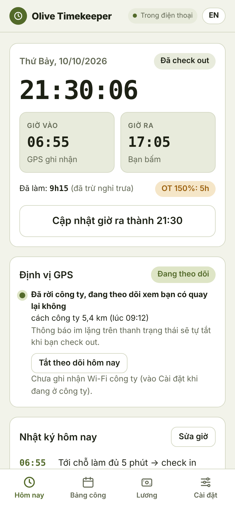
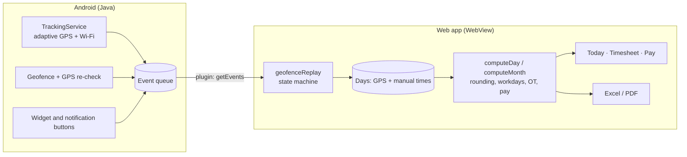

# Olive Timekeeper

[](https://github.com/dphuonganh019/olive-timekeeper/actions/workflows/build-apk.yml)

**A personal timekeeping app for Android that checks you in and out by itself.** It knows when you arrive at the office, when you leave on a business trip, and when you go home, even with the app closed. It turns those times into workdays, overtime and an estimated monthly salary, following the actual rules of a Vietnamese company. Available in **English and Vietnamese**.

<p align="center">
  
  
  
  
</p>

## Why I built it

My workday rarely fits a fixed 8:00–17:00 schedule. Some days I arrive at 6:00, stop at the office for a few minutes and leave on a business trip; other days I work an afternoon shift or stay late. Company timesheets round times, subtract lunch, count overtime in 30-minute steps and pay different rates on Sundays and public holidays, so checking my own payslip by hand was slow and error-prone. Olive Timekeeper records the times for me and applies exactly those rules.

## Highlights

### Automatic check-in that gets the time right
- **Arrival time, not detection time.** After you have been at the office for 5 minutes you are checked in, and the check-in time is the moment you *arrived*.
- **Business trips are recognised automatically.** Leaving within the first hour after check-in starts a trip; coming back ends it; passing by the office on the way doesn't.
- **Check-out when you leave**, confirmed by two consecutive readings so GPS drift inside a building can't end your day early. Leaving for lunch and coming back is not a check-out.
- **Adaptive tracking.** A foreground service starts at 05:30 on workdays and measures your location every 10 minutes when you're far away, every 30 seconds when you're close, and every 2 minutes once you're inside, saving battery.
- **Office Wi-Fi as a second signal.** The app remembers your office's access points (no connection needed), which works even where GPS is weak.
- **No false check-ins.** Android geofences, which can be off by kilometres when only cell towers are available, are kept as a backup, and every signal is re-measured with high-accuracy GPS before it counts. A signal log on the Today screen shows each reading and why it was accepted or ignored.

### Manual control whenever you want it
- **Home-screen widget** with a single button: Check in → Check out → Update check-out.
- **Notification actions:** *Confirm 06:55*, *Not there yet*, *Check out now*, *Day off today*.
- **Edit any day.** Times you enter always win over automatic ones, and you can switch back to the GPS times at any point.

### Payroll rules built in
- Times rounded down to 15-minute blocks (06:07 → 06:00, 17:43 → 17:30).
- Lunch subtracted only when the shift spans 12:00–13:00, so morning and afternoon half-days work naturally.
- Workdays count whole hours only (4h45 = 0.5 day); a business-trip day of 7 hours or more counts as a full day; 4 hours on Saturday is a full day.
- Overtime at **150%** (beyond the standard hours, from 30 minutes, in 30-minute steps), **200%** on Sundays and compensatory days, **300%** on public holidays, with Vietnamese public holidays for 2026–2027 preloaded.
- Probation and permanent salaries, each applied from its start date, even when it changes mid-month.

### Reports and data
- **Excel and PDF export** of the monthly timesheet and pay breakdown, in the chosen language, shared straight from the phone.
- **Bilingual interface**: English and Vietnamese, switchable with one tap. Log entries are stored as codes, so past entries switch language too, and notifications and the widget follow the app.
- **Private by design:** no server and no account. Location never leaves the phone; the signal log stores only distances, not coordinates. JSON backup and restore.

## How it works



- **Native layer** (`android/app/src/main/java/app/olive/timekeeper/`): a location foreground service with five states (waiting → arriving → inside → outside → ended), a geofence receiver with GPS re-verification, office Wi-Fi matching, an exact daily alarm, the home-screen widget and a Capacitor plugin. Everything it observes is written to an event queue, so nothing is lost while the app is closed.
- **Logic layer** (`src/core.js`): pure functions with no DOM access. A state machine replays the queued events into check-in, trips and check-out, and the pay rules turn days into workdays, overtime and pay. Covered by unit tests.
- **Interface** (`src/app.js`, `src/i18n.js`, `src/*.html`): a dependency-free single-page app. The same build runs inside the Android app, as a static page, or as a claude.ai artifact with per-user cloud storage.

**Tech stack:** JavaScript (no framework), Capacitor 8, Java, Google Play services Location, SheetJS, jsPDF + html2canvas, Node's built-in test runner, GitHub Actions.

## Quality

- **25 automated tests** run on every build, covering rounding, half days, Saturday rules, overtime rates, salary changes, business trips, false geofence signals, lunch breaks, widget punches and active-tracking scenarios taken from real days, plus checks that every English text has a Vietnamese counterpart with the same placeholders.
- The build fails if any test fails, so a broken rule can't ship.
- The UI was exercised in a headless browser against a simulated Android bridge, in both languages.

```bash
TZ=Asia/Bangkok npm test
```

## Install

1. Open the latest release under **Releases** on your Android phone and download `OliveTimekeeper-v1.0.N.apk`.
2. Open the file and allow installing from this source.
3. In the app: **Settings → Workplace → Use current location** while you're at the office, then allow location **"All the time"**, allow notifications and turn off battery optimization for the app.
4. Optionally save the office Wi-Fi, enter your pay rate and add the widget.

New versions install over the old one and keep your data. Upgrading from 1.0.8 or earlier: add the widget again once.

## Build from source

```bash
npm ci
TZ=Asia/Bangkok npm test   # timekeeping logic and translation tests
npm run build:web          # www/ for the app or a static host, dist/artifact.html for claude.ai
npx cap sync android       # copy the web app into the Android project
cd android && ./gradlew assembleRelease
```

The GitHub Actions workflow (`.github/workflows/build-apk.yml`) does all of this on every push to `main`, signs the APK and publishes a release. Signing needs two repository secrets: `OLIVE_KEYSTORE_BASE64` (the keystore, base64-encoded) and `OLIVE_KEYSTORE_PASSWORD`.

## Documentation

The full requirements specification, with 27 user stories, acceptance criteria, business rules BR-01 to BR-16 and non-functional requirements, is in [docs/SPECIFICATION.md](docs/SPECIFICATION.md).

## Project layout

```
src/
  core.js         timekeeping rules and the event state machine (pure, tested)
  i18n.js         English / Vietnamese text and formatting
  app.js          user interface, storage, exports
  head.html       styles (light and dark)
  body.html       markup
tests/            unit and translation tests
scripts/          web build
android/          Capacitor project and the native Java code
docs/             specification and screenshots
```
