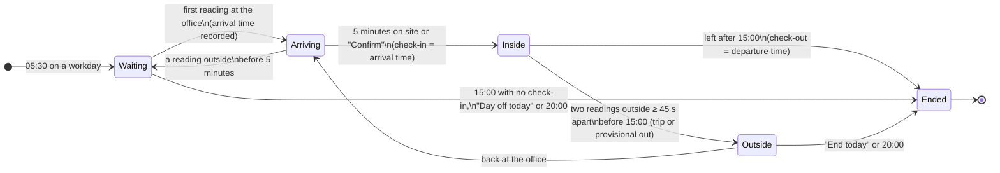

# Olive Timekeeper — Requirements Specification

Version 1.1 · October 2026 · Author: Phuong Anh

## Contents

1. [Overview](#1-overview)
2. [Constraints and assumptions](#2-constraints-and-assumptions)
3. [Business rules](#3-business-rules)
4. [Epic 1 – Manual check-in and editing](#4-epic-1--manual-check-in-and-editing)
5. [Epic 2 – Automatic location-based check-in](#5-epic-2--automatic-location-based-check-in)
6. [Epic 3 – Widget and notifications](#6-epic-3--widget-and-notifications)
7. [Epic 4 – Monthly timesheet and pay estimate](#7-epic-4--monthly-timesheet-and-pay-estimate)
8. [Epic 5 – Excel and PDF export](#8-epic-5--excel-and-pdf-export)
9. [Epic 6 – Settings, holidays, language, backup](#9-epic-6--settings-holidays-language-backup)
10. [Non-functional requirements](#10-non-functional-requirements)
11. [Distribution and updates](#11-distribution-and-updates)
12. [Open issues and points to confirm](#12-open-issues-and-points-to-confirm)

## 1. Overview

Olive Timekeeper is an Android app that lets an employee record their own check-in and check-out times, log business trips, and estimate their monthly pay under their company's rules. Times entered by the user always take priority over automatically recorded ones. The app is available in English and Vietnamese.

**Goals**

- Record check-in/out times automatically from location (GPS, office Wi-Fi), including days when the user stops at the office and then leaves on a business trip.
- Allow check-in/out by tapping a button, the home-screen widget or a notification, and allow editing the times of any day.
- Calculate workdays and overtime at 150% / 200% / 300%, estimate monthly pay, and export a detailed timesheet to Excel or PDF.

**Scope**

| In scope | Out of scope |
| --- | --- |
| One user on one Android phone | Managing several employees, timesheet approval |
| One workplace | Several offices or branches |
| Pay estimate before tax and insurance | Personal income tax, social insurance, allowances, bonuses, deductions |
| A web version for manual check-in (claude.ai, static hosting) | An iOS app |
| Vietnamese public holidays for 2026–2027 preloaded | Automatic holiday updates for later years |
| English and Vietnamese user interface | Other languages |

**Primary user:** an employee who works Monday to Saturday; some days at the office, some days arriving at the office between 6:00 and 6:30 and then leaving on a long business trip; usually on mobile data (3G/4G), with an Android phone (Samsung).

**Platform:** an Android app built with Capacitor 8 (the interface is a web app running in a WebView; background work is written in Java), Android 7.0 or later (minSdk 24, targetSdk 36). The web version supports manual check-in only and does not run in the background.

**Glossary**

| Term | Meaning in this document |
| --- | --- |
| Office zone | A circle around the office coordinates, 150 m radius by default |
| Check-in / check-out time | The start / end of the counted working time for a day |
| Effective check-in | The manually entered time if there is one, otherwise the GPS time |
| Workday (*công*) | The unit of attendance; 1 workday = the full standard hours of that day |
| Monthly standard workdays | The number of Monday–Saturday days in the month (default), used to derive the daily rate |
| Business trip | Leaving the office within the first 60 minutes after check-in to work elsewhere |
| Cutoff | 15:00; leaving the office after this time counts as check-out |
| Provisional check-out | Leaving the office before the cutoff, not on a business trip; it becomes the check-out if the user is not back within the waiting time (BR-17) or confirms it |
| Active tracking | A background service that measures location periodically and shows a persistent status-bar notification |
| Geofence | A zone signal raised by Android; battery-friendly but 2–6 minutes late and sometimes far off |
| Quick punch | Check-in/out from the widget or a notification button without opening the app |

## 2. Constraints and assumptions

Automatic check-in only works when location access is set to "Allow all the time" and Android does not block the app from running in the background. Every automatically recorded time can be overridden by the user.

**Constraints**

| ID | Constraint | Impact |
| --- | --- | --- |
| C-01 | Android 7.0 or later. "All the time" location access is a separate permission from Android 10 | On Android 10+ the user must also choose "Allow all the time" in Settings |
| C-02 | Required permissions for automatic check-in: precise location, background location, notifications (Android 13+) | Without them only manual check-in works; the Location card shows buttons to grant them |
| C-03 | Optional permissions: exact alarms (granted automatically from Android 13), Wi-Fi state, ignore battery optimization | Without exact alarms the 05:30 start may be late. With battery optimization on, Android may stop the background service |
| C-04 | Android requires a persistent notification while an app uses GPS continuously in the background | The notification cannot be hidden while tracking; it is set to silent |
| C-05 | Android geofences fire 2–3 minutes late on average, up to about 6 minutes when the phone is still, and mostly rely on network location | Not fast enough for an 8-minute stop at the office, so geofencing is only a backup |
| C-06 | On the move without Wi-Fi, network location can be off by hundreds of metres to several kilometres | Every "entered" signal must be re-measured with high-accuracy GPS before it counts |
| C-07 | Samsung, Xiaomi, Oppo and Vivo may kill background apps | The user needs to turn off battery optimization and allow auto-start |
| C-08 | Data is stored only on the device (WebView storage and Android storage); there is no server | Uninstalling or changing phones without a backup loses the data |
| C-09 | The web version inside claude.ai cannot use GPS; its data is stored per claude.ai account | The web version is manual only and does not sync with the Android app |
| C-10 | Distributed as an APK installed by hand, not through Google Play | The user must allow installs from unknown sources |
| C-11 | Times use the phone's clock and time zone (Vietnam, UTC+7) | Changing the time zone or a wrong clock records wrong times |

**Source priority for times** (earlier sources win over later ones)

1. Times the user enters or edits in the app.
2. Quick punches from the widget or a notification (stored as manual times).
3. Active tracking (periodic GPS + office Wi-Fi).
4. Geofence, only when active tracking is not running; while active tracking runs, geofence signals are logged for reference only.
5. GPS while the app is open on screen (standalone web version).

**Assumptions**

- A-01: There is one fixed workplace.
- A-02: The schedule is Monday–Friday full days and Saturday half days (08:00–12:00), with Saturday still counting as 1 full workday; Sunday is a day off.
- A-03: Public holidays follow the 2019 Labour Code plus Vietnam Culture Day (24 November); 2026–2027 are preloaded and the user adds later years.
- A-04: The pay entered is the gross monthly salary, before allowances and deductions.
- A-05: Lunch is fixed at 12:00–13:00 for every day type, including Sundays and public holidays.

## 3. Business rules

All calculations use check-in/out times rounded down to 15-minute blocks. Workdays count whole hours only; overtime counts in 30-minute steps.

| ID | Rule | Example |
| --- | --- | --- |
| BR-01 | Check-in and check-out are both rounded **down** to 15-minute blocks (block size and rounding mode are configurable) | 06:07 → 06:00 · 06:47 → 06:45 · 17:43 → 17:30 |
| BR-02 | Hours worked = check-out − check-in − the overlap with lunch (12:00–13:00). Lunch is only subtracted when the shift spans it | 08:00–17:00 = 8 h · 13:00–17:00 = 4 h · 08:00–12:00 = 4 h |
| BR-03 | Monday–Friday workdays = whole hours ÷ 8, capped at 1. A partial hour earns nothing | 4h45 → 0.5 · 7 h → 0.875 · 8h15 → 1 |
| BR-04 | A Monday–Friday day with a business trip: 7 hours or more counts as 1 workday; under 7 hours follows BR-03 | 09:30–17:30 with a trip → 1 · 09:30–17:15 → 0.75 |
| BR-05 | Saturday: 4 standard hours = 1 workday; under 4 hours counts whole hours ÷ 4 | 08:00–12:00 → 1 · 08:00–11:30 → 0.75 |
| BR-06 | 150% overtime (Monday–Saturday): time beyond the standard hours (8; Saturday 4), rounded down to 30-minute steps; under 30 minutes earns nothing | 08:00–17:15 → 0 · 08:00–17:43 → 0.5 h · 06:30–17:00 → 1.5 h |
| BR-07 | 200% overtime: Sundays and compensatory days off. All hours worked (lunch excluded), in 30-minute steps; no regular workday credit | Sunday 08:00–17:00 → 8 h × 200% |
| BR-08 | 300% overtime: public holidays. All hours worked (lunch excluded), in 30-minute steps | 24 Nov 08:00–17:00 → 8 h × 300% |
| BR-09 | A public holiday or compensatory day falling on Monday–Saturday earns 1 paid workday whether or not the user works | 24 Nov 2026 (Tuesday) → 1 holiday workday |
| BR-10 | Monthly standard workdays = the number of Monday–Saturday days in the month; can be fixed at 24 or 26 instead | October 2026 → 27 |
| BR-11 | Daily rate = monthly pay ÷ standard workdays. Hourly rate = daily rate ÷ 8 (Saturdays included) | 10,800,000 ÷ 27 = 400,000/day = 50,000/hour |
| BR-12 | A pay rate applies from its start date; each day uses the rate with the latest start date on or before it | Probation from 1 Oct, permanent from 15 Oct → the two periods are calculated separately |
| BR-13 | Estimated pay = (workdays + holiday workdays) × daily rate + OT hours × hourly rate × multiplier, summed day by day; before tax and insurance | See the example below the table |
| BR-14 | A past day without a check-out, or with a check-out not after the check-in, earns no workday and is flagged ⚠ | In 08:10, no out → 0 workdays |
| BR-15 | Today without a check-out is counted up to the current time | — |
| BR-16 | Leaving the office before the cutoff, not on a business trip, and not returning: the departure time becomes a provisional check-out | Morning shift 07:58–12:02 → 0.5 workday |
| BR-17 | A provisional check-out becomes the check-out after 60 minutes away (configurable). Leaving from 30 minutes before lunch until lunch ends waits until 30 minutes after lunch instead. A day that ended with a provisional check-out is settled the next time the app opens | Left 10:00 → final at 11:00 · left 12:08 → final at 13:30 |

Example for BR-13: probation pay of 10,800,000 VND, October 2026, 6 October in at 08:00 and out at 17:43 → 1 workday (400,000 VND) + 0.5 h OT × 50,000 × 1.5 (37,500 VND) = 437,500 VND.

## 4. Epic 1 – Manual check-in and editing

The user can always record check-in/out times by hand and edit the times of any day; manual times win over every automatic source.

### US-01 – Check in with a button

As an employee, I want to tap Check in when I arrive so that my check-in time is recorded correctly.

- AC-01.1: No check-in yet today → the Today tab shows a "Check in at HH:MM" button with the current time.
- AC-01.2: Tapping it → check-in = the hour and minute of the tap, source "Entered by you"; the log shows "You checked in"; a toast shows "Checked in at HH:MM".
- AC-01.3: A GPS check-in already exists → the manual time is used; the check-in slot shows "Entered by you · GPS hh:mm".
- AC-01.4: Data is still loading → nothing is recorded and "Still loading data. Try again in a few seconds." is shown.
- AC-01.5: After the tap, the widget and the tracking notification show the new check-in time.

### US-02 – Check out with a button

As an employee, I want to tap Check out when I leave so that my real check-out time is recorded.

- AC-02.1: Checked in, not checked out → a "Check out at HH:MM" button.
- AC-02.2: Already checked out → an "Update check-out to HH:MM" button; tapping it replaces the old time and the log shows "Updated check-out (was hh:mm)".
- AC-02.3: After check-out, today's status is "Checked out" and active tracking stops for the day.
- AC-02.4: A manual check-out wins over a GPS check-out and a provisional check-out.

### US-03 – Edit any day

As an employee, I want to correct my own check-in/out times when GPS is wrong or I forgot to tap.

- AC-03.1: The edit sheet opens from "Edit times" (today), from a row in the Timesheet, or from "+ Add / edit day" (today if the current month is shown, otherwise the 1st).
- AC-03.2: The sheet has Date, Check-in, Check-out, "I went on a business trip this day" and Note; it shows the weekday, the day type (weekday, Saturday, Sunday, public holiday, compensatory day) and any GPS times recorded.
- AC-03.3: Check-out not after check-in → not saved, "Check-out must be after check-in". A check-out without a check-in → "Enter the check-in time first".
- AC-03.4: An entered time equal to the GPS time → stays a GPS time. A different time → stored as a manual time. An empty field → clears that time, including the GPS time.
- AC-03.5: "Use GPS times" appears only when the day has GPS times; tapping it removes the manual times.
- AC-03.6: "Delete this day" needs two taps; after the first, the button reads "Tap again to delete".
- AC-03.7: Every save that changes a time adds "Edited times: in …, out …" to the log with the time of the edit.
- AC-03.8: Changing the date in the sheet loads that day.
- AC-03.9: The sheet closes with ✕, Esc or a tap outside, without saving.

### US-04 – Mark a business-trip day by hand

As an employee, I want to mark a day as a business-trip day when GPS didn't record it.

- AC-04.1: Ticking "I went on a business trip this day" → the day follows BR-04; the Business trip column shows "Yes".
- AC-04.2: Unticking it on a day with a GPS-recorded trip → that trip is removed.

## 5. Epic 2 – Automatic location-based check-in

On each workday, from 05:30 until 15:00, the app waits for the user to arrive at the office. After 5 minutes on site it checks the user in with the arrival time, then keeps tracking until they leave. Android geofencing is only a backup layer.

**"At the office"** (used by every story below): the distance to the zone centre ≤ radius + min(location accuracy, 100 m), **or** at least one saved office Wi-Fi network is visible at ≥ −88 dBm. "Outside" = a location is available, no office Wi-Fi is visible, and the distance exceeds that threshold. No location and no Wi-Fi = unknown; that reading is ignored.

Tapping "Check out now" (on the notification, the widget or in the app) at any step goes straight to Ended. Leaving before the 5 minutes are up returns to the previous step.

### US-05 – Check in automatically on arrival

As an employee, I want the app to check me in exactly when I arrive at the office, even when I only stop for about 8 minutes before a business trip.

- AC-05.1: First reading "at the office" → the arrival time = the time of that reading; the notification changes to "Arrived at the office at HH:MM · Checking in automatically after 5 min (N min left)".
- AC-05.2: At the office continuously for 5 minutes (configurable) → check in with **check-in = arrival time**, without adding the 5 minutes; notification "Checked in at HH:MM (GPS)".
- AC-05.3: A reading "outside" before the 5 minutes are up → the arrival time is discarded and the app returns to waiting.
- AC-05.4: "Confirm HH:MM" on the notification → check in immediately, still with the arrival time.
- AC-05.5: "Not there yet" → the arrival time is discarded; the app ignores "at the office" until it has measured "outside" at least once.
- AC-05.6: A manual check-in already exists → GPS creates no new check-in and only logs "At the office (already checked in manually at hh:mm)".
- AC-05.7: "Check in now" while waiting → the tap time is recorded as a manual time.

### US-06 – Record a business trip (case 1)

As an employee, I want the app to recognise days when I stop at the office and then leave on a business trip, so that those days follow the business-trip rule.

- AC-06.1: After check-in, the first departure of the day before 15:00 and within 60 minutes of the effective check-in (GPS or manual) → a business trip starting at the departure time.
- AC-06.2: Only the first departure can be a business trip; later ones are just "out".
- AC-06.3: Coming back and staying 5 minutes → the trip ends at the arrival time; notification "Back at the office at HH:MM".
- AC-06.4: Passing by the office (inside for less than 5 minutes) does not end the trip.
- AC-06.5: A day with a business trip follows BR-04; the tracking notification shows "On a business trip since HH:MM".
- AC-06.6: Going straight home after a trip without returning to the office → no automatic check-out; the user taps the widget or edits the times.

### US-07 – Check out automatically when leaving

As an employee, I want the app to record exactly when I leave so that my check-out doesn't slip into a different 15-minute block.

- AC-07.1: While inside, a reading "outside" → recorded as the first reading outside, and readings speed up to every 30 seconds. A second reading "outside" at least 45 seconds after the first → departure confirmed, **departure time = the first reading outside**. A reading back inside → cancelled.
- AC-07.2: Leaving at 15:00 or later → check out with check-out = departure time; notification "Checked out at HH:MM (GPS)"; tracking stops for the day.
- AC-07.3: Leaving before 15:00 and not on a trip → the log shows "Left the office at HH:MM → becomes check-out if you don't return". The Timesheet shows that time with "(provisional)"; the Today tab shows "Left the office · becomes your check-out if you're not back by HH:MM" and a "Confirm check-out at HH:MM" button; the widget shows the time with an asterisk ("12:08*").
- AC-07.4: Returning within the waiting time (for example after lunch) → the provisional check-out is dropped and time keeps counting.
- AC-07.7: Not back when the waiting time ends (BR-17) → the departure becomes the check-out; the log shows "Not back after leaving at HH:MM → checked out at HH:MM (GPS)"; the notification "Checked out at HH:MM (GPS)" appears and tracking stops for the day. Coming back later still clears it (AC-07.5).
- AC-07.8: "Confirm check-out at HH:MM" (app), "Confirm out HH:MM" (notification) or "CONFIRM OUT HH:MM" (widget) → the departure time becomes the check-out immediately, not the time of the tap.
- AC-07.5: Returning after a GPS check-out → that check-out is dropped and the log shows "Back at the office → check-out hh:mm cleared".
- AC-07.6: "Check out now" → the tap time is recorded as a manual time and tracking stops.

### US-08 – Scheduled active tracking

As an employee, I want tracking to start by itself every workday morning without opening the app, covering early starts, late starts and afternoon shifts.

- AC-08.1: On a workday (Monday–Saturday, not a public holiday or compensatory day), at exactly 05:30 (configurable) the service starts if: the office location is set, background location is allowed, today hasn't been ended and there is no check-out yet.
- AC-08.2: Opening the app between 05:30 and 20:00 on a workday → the service starts if it isn't running.
- AC-08.3: Reading interval by distance: over 5 km → every 10 minutes, battery-saving mode; 1–5 km → every 2 minutes, GPS; under 1 km or while confirming an arrival/departure → every 30 seconds, GPS; inside the office → every 2 minutes, battery-saving mode.
- AC-08.4: Wi-Fi is scanned at most once every 2 minutes, and only within 2 km of the office or when not waiting.
- AC-08.5: The service stops when: the user has checked out (GPS, widget, notification or app); the user taps "Day off today", "End today" or "Stop tracking today"; it reaches 20:00 (configurable); a new day starts; or it reaches 15:00 with no check-in.
- AC-08.6: Stopping at 15:00 because the user never arrived → notification "You haven't arrived at the office today", and today is marked as ended.
- AC-08.7: A manual check-in exists but GPS hasn't seen the user at the office → no stop at 15:00; tracking continues until 20:00.
- AC-08.8: Android refuses to start the service → notification "Tap to turn on automatic check-in today"; opening the app starts it.
- AC-08.9: After a reboot or an app update → the 05:30 alarm is rescheduled, the zone re-registered and the service started if within tracking hours.
- AC-08.10: "Resume today" on the Today tab → clears the ended state and restarts the service.
- AC-08.11: If the system kills the service midway, it resumes from its saved state (waiting, arriving, inside, outside).

### US-09 – Recognise the office by its Wi-Fi

As an employee on mobile data, I want the app to recognise that I'm at the office from the office Wi-Fi, without connecting to it.

- AC-09.1: Settings → "Save office Wi-Fi": scans for about 5 seconds, stores up to 15 of the strongest access points (≥ −82 dBm) by BSSID, and lists the saved network names.
- AC-09.2: Wi-Fi is off and "Wi-Fi scanning" is off → "Turn on Wi-Fi (no need to connect) and try again"; nothing is saved.
- AC-09.3: No strong network found → "No strong Wi-Fi found. Try again closer to an access point."
- AC-09.4: "Clear" → removes the saved office networks.
- AC-09.5: Office Wi-Fi visible → counts as "at the office" even if GPS reports a large distance (GPS is weak inside buildings).

### US-10 – Geofence as a backup

As an employee, I want the app to keep recording when active tracking isn't running (outside tracking hours, or stopped by Android) without false check-ins.

- AC-10.1: A circular zone around the office is registered (radius at least 50 m) for enter, dwell (5 minutes) and exit signals, even when the app is closed; it is re-registered after a reboot.
- AC-10.2: Every enter or dwell signal is re-measured with high-accuracy GPS (up to about 25 seconds). If the real position is outside → the signal is ignored and logged with the reason.
- AC-10.3: After an ignored signal → the app re-measures every 5 minutes, up to 12 times (1 hour); a reading "at the office" records the arrival and confirms it after 5 minutes; when the attempts run out, the zone is re-registered.
- AC-10.4: While active tracking runs → geofence signals are logged as "for reference only" and change nothing.
- AC-10.5: An enter signal followed by an exit signal with no dwell signal, at least 5 minutes apart → still checks in at the enter time.
- AC-10.6: A departure is confirmed only after 3 minutes outside (configurable); departure time = the exit signal.

### US-11 – See status and location signals

As an employee, I want to know what the app is doing and why it recorded a time, so that I can check it myself and report problems.

- AC-11.1: The Location card shows one status: Waiting for you to arrive · Arrived, confirming 5 minutes · At the office · Left the office · Stopped for today · Outside tracking hours — with the last distance, its time and the saved Wi-Fi networks.
- AC-11.2: Missing permissions → the card explains and offers "Allow location" or "Open location settings"; battery optimization on → "Turn off battery optimization".
- AC-11.3: "Today's log" lists timekeeping events by time (taps, GPS arrivals/departures, trips, edits).
- AC-11.4: "Location signals received" lists each signal: time, type (entered zone / stayed in zone / left zone), distance, accuracy and source (active tracking, app re-checked, office Wi-Fi seen, for reference only). Ignored signals are highlighted. Up to 60 signals are kept per day.
- AC-11.5: While the app is open it reads new signals and refreshes the card every 30 seconds; reopening the app reads them immediately.

## 6. Epic 3 – Widget and notifications

The user can check in and out without opening the app, from the widget or notification buttons. The tracking notification is always silent; event notifications alert once.

### US-12 – Home-screen widget

As an employee, I want to check in or out right from my home screen so that the exact time is recorded without opening the app.

- AC-12.1: A 3×2 widget (resizable) shows the weekday and date, IN and OUT ("--:--" when empty) and one large button.
- AC-12.2: Button label: no check-in → CHECK IN; checked in, not out → CHECK OUT; left early with a provisional check-out → CONFIRM OUT HH:MM (AC-07.8); both → UPDATE CHECK-OUT.
- AC-12.3: Tapping it → records the tap time as a manual time; shows "Checked in at HH:MM" or "Checked out at HH:MM"; the widget updates immediately.
- AC-12.4: Another tap within 60 seconds → ignored with "You just tapped. Wait a minute to tap again."
- AC-12.5: Checking out from the widget → today is marked as ended and active tracking stops.
- AC-12.6: Tapping the information area (date, times) → opens the app.
- AC-12.7: A new day → the widget clears (within 30 minutes, or at 05:30).
- AC-12.8: Times changed in the app (tap, edit, GPS) → the widget shows the new effective times; a provisional check-out is shown with an asterisk.
- AC-12.9: The next time the app opens, all widget taps are merged into the timesheet in time order. A check-in tap when a manual check-in already exists → ignored and noted in the log.
- AC-12.10: The widget text follows the language chosen in the app.

### US-13 – Tracking notification (persistent, silent)

As an employee, I want to see which step tracking is at and act on it from the notification, without being disturbed.

- AC-13.1: The "Check-in tracking" channel is low importance: no sound, no vibration, no heads-up, no badge.
- AC-13.2: The notification cannot be swiped away while the service runs and disappears when it stops. Tapping it opens the app.
- AC-13.3: Content and buttons by state:

| State | Title | Text | Buttons |
| --- | --- | --- | --- |
| Waiting, no check-in | Waiting for you to arrive at the office | 3.2 km from the office · updated 06:41 | Check in now · Day off today |
| Arrived, confirming | Arrived at the office at 06:55 | Checking in automatically after 5 min (3 min left) · check-in time will be 06:55 | Confirm 06:55 · Not there yet |
| Returned, confirming | Back at the office at 16:50 | Confirming you're here (N min left) | Confirm 16:50 · Not there yet |
| Checked in manually, not yet seen at the office | Checked in at 06:58 | Check-out is recorded when you leave the office · … from the office | Check out now · End today |
| At the office | At the office · in at 06:55 | Check-out is recorded when you leave | Check out now |
| Left on a business trip | On a business trip since 07:03 | The app will record when you return to the office · … from the office | Check out now · End today |
| Left before 15:00 | Left the office at 12:08 | If you're not back by 13:30, 12:08 becomes your check-out · … from the office | Confirm out 12:08 · Check out now · End today |

- AC-13.4: Notification text and channel names follow the language chosen in the app.

### US-14 – Event notifications

As an employee, I want to be told once when the app records a time automatically, so that I can fix it if it's wrong.

- AC-14.1: The "Automatic check-in" channel has default importance: one sound or vibration according to the phone's settings, can be swiped away, opens the app when tapped. The user can make this channel silent in Android settings.
- AC-14.2: Android 13+ requires notification permission; the app asks for it right after location permission.
- AC-14.3: Notifications:

| When | Title |
| --- | --- |
| The app checks in automatically (first time that day) | Checked in at HH:MM (GPS) |
| Back at the office after leaving | Back at the office at HH:MM |
| The app checks out automatically, or "Check out now" is tapped | Checked out at HH:MM |
| Not back after leaving early (BR-17) | Checked out at HH:MM (GPS) |
| 15:00 on a workday, not arrived, "Day off today" not tapped | You haven't arrived at the office today |
| Android blocks tracking from starting | Tap to turn on automatic check-in today |
| Backup geofence records an arrival (service not running) | Arrived at the office |
| Backup geofence records a departure (service not running) | Left the office |

- AC-14.4: Signals ignored because the real position is far away produce no notification.

## 7. Epic 4 – Monthly timesheet and pay estimate

The Timesheet tab shows every day of the month with totals. The Pay tab estimates pay according to BR-01 to BR-17 and manages pay rates.

### US-15 – View the monthly timesheet

As an employee, I want to see each working day of the month in detail so that I can compare it with my company's timesheet.

- AC-15.1: Months are switched with ‹ ›; the title is "October 2026" (English) or "Tháng 10 / 2026" (Vietnamese); the app opens on the current month.
- AC-15.2: Six summary tiles: Hours worked, Workdays / standard (including holiday workdays), OT 150%, OT 200%, OT 300%, Trip days.
- AC-15.3: One row per day for every day of the month, with columns: Date + weekday · Type (Sat, Sun, Holiday, Comp. day) · In · Out · Lunch (minutes) · Worked · Workday · OT 150% · OT 200% · OT 300% · Business trip · Note.
- AC-15.4: In/Out show the actual time, a dot for the source (olive = manual, purple = GPS) and, if different, the rounded time ("06:55 → 06:45"). A provisional check-out shows "(provisional)"; today while working shows "working".
- AC-15.5: The Business trip column shows the trip's time range ("07:03–16:50", or "07:03–…" if not back) or "Yes" when marked by hand. The Note column shows the user's note, or the holiday name.
- AC-15.6: Today's row is highlighted; Sundays and compensatory days have a blue bar, public holidays a red bar; days not worked are dimmed; days missing a check-out or with an invalid one show ⚠.
- AC-15.7: A Total row ends the table; if there are ⚠ days, a warning with their number appears above the table.
- AC-15.8: The table scrolls horizontally on phones with the Date column pinned; tapping a row opens the edit sheet for that day (US-03).

### US-16 – Enter and update pay rates

As an employee, I want to enter my probation and permanent pay with their start dates so that the month I become permanent is calculated correctly.

- AC-16.1: The form has Applies from, Monthly pay (VND) and Status (Probation / Permanent). Missing date or amount → not saved, "Enter the start date and the amount".
- AC-16.2: The amount field accepts digits only and adds thousands separators while typing (10,000,000 in English, 10.000.000 in Vietnamese).
- AC-16.3: Saving a rate with the same start date as an existing one → replaces it.
- AC-16.4: Rates are listed newest first, each with amount, status label, start date and a delete button.
- AC-16.5: Adding, changing or deleting a rate → the timesheet and Pay tab recalculate immediately, including past months.

### US-17 – View the monthly pay estimate

As an employee, I want to know roughly what this month's pay will be, broken down by component.

- AC-17.1: The estimated total is shown large, marked "before tax and insurance".
- AC-17.2: Below the total: the status and pay rate applied (or "Pay rate changed this month (calculated per day)"), the standard workdays and the hourly-rate formula.
- AC-17.3: A five-line breakdown plus total: Pay for days worked (workdays × daily rate) · Paid holidays / compensatory days (days) · OT 150% · Sunday / comp. day 200% · Public holiday 300% (each OT line shows the hours and "hourly rate × multiplier / hour").
- AC-17.4: Workdays without an applicable pay rate → a warning with their number, suggesting a rate with an earlier start date; those days count as 0.
- AC-17.5: Amounts are rounded to the dong and formatted for the chosen language (1,219,906 ₫ / 1.219.906 ₫).

## 8. Epic 5 – Excel and PDF export

From the Pay tab, the user can export the timesheet and pay estimate of the month on screen to Excel or PDF, with the same figures as on screen, in the chosen language.

### US-18 – Export to Excel

As an employee, I want to export my timesheet to Excel to filter it, compare it and send it to HR.

- AC-18.1: File name `timesheet-YYYY-MM[-full-name-without-accents].xlsx` in English or `bang-luong-YYYY-MM[…].xlsx` in Vietnamese, e.g. `timesheet-2026-10-Nguyen-Van-A.xlsx`; one sheet named "Timesheet MM-YYYY" / "Bang cong MM-YYYY".
- AC-18.2: Header: the title "TIMESHEET & PAY ESTIMATE · OCTOBER 2026"; Employee, Status, Monthly pay, Standard workdays, Hourly rate, Exported at.
- AC-18.3: One row per day with 21 columns: Date · Day · Day type · Check-in · In (rounded) · In source · Check-out · Out (rounded) · Out source · Lunch (min) · Worked (h) · Workdays · Holiday / comp. workdays · OT 150% · OT 200% · OT 300% (h) · Business trip · Day pay · OT pay · Day total · Note.
- AC-18.4: The time source reads "Manual" or "GPS"; a missing check-out reads "MISSING"; today without a check-out reads "working".
- AC-18.5: A TOTAL row follows the days, then a PAY SUMMARY with the five components and the ESTIMATED TOTAL, matching the Pay tab.
- AC-18.6: Money columns use `#,##0`; hours are decimals with 2 places; the day table has an auto-filter; column widths are preset.

### US-19 – Export to PDF

As an employee, I want a compact PDF to send or keep.

- AC-19.1: File name as in AC-18.1 with `.pdf`; A4 landscape, 3 pages, always on a white background even in dark mode.
- AC-19.2: Page 1: the title "Timesheet · October 2026", employee details and days 1–16. Page 2: the remaining days and the Total row. Page 3: the pay estimate (five components + total) with a paragraph explaining the method (standard workdays, Saturday standard hours, rounding block, OT step).
- AC-19.3: The PDF day table has 14 columns: Date, Day, Type, In, Out, Lunch, Worked, Workday, OT 150%, OT 200%, OT 300%, Business trip, Amount, Note; rounded times appear as "06:55 → 06:45" and GPS times carry "(GPS)".
- AC-19.4: Every page footer reads "Olive Timekeeper · An estimate; it does not replace your company's official payslip" and "Page n/3".

### US-20 – Save and share exported files

- AC-20.1: In the Android app → the system share sheet opens to save the file or send it (Zalo, email…); cancelling shows no error.
- AC-20.2: On claude.ai → claude.ai's download confirmation appears; declining shows no error. In a regular browser → the file downloads directly.
- AC-20.3: The export libraries are bundled in the Android app (no network needed); the web version loads them from cdnjs. On failure → "Couldn't create the … Check your connection and try again."
- AC-20.4: The export button is disabled while a file is being created, to avoid double taps.

## 9. Epic 6 – Settings, holidays, language, backup

Every rule in section 3 has a default matching company policy, and most can be changed in the Settings tab. Changes are saved as soon as a field loses focus, with the toast "Settings saved".

### US-21 – Profile

- AC-21.1: A Full name field; used in file names and in the Excel/PDF header; when empty, file names have no name suffix.

### US-22 – Workplace

As an employee, I want to set the office location once so that the app knows when I'm there.

- AC-22.1: Fields: Place name, Latitude, Longitude, Radius (metres, minimum 30; the geofence uses at least 50).
- AC-22.2: "Use current location" → fills in coordinates with 6 decimals and reports the accuracy; if no location is available, it suggests pasting coordinates from Google Maps.
- AC-22.3: "View the saved location on a map" opens Google Maps at the saved coordinates.
- AC-22.4: Changing the coordinates or radius → the zone is re-registered and tracking reconfigured immediately.
- AC-22.5: No office location → the Location card points to Settings; automatic check-in does not run.

### US-23 – Timekeeping rules

As an employee, I want to adjust the thresholds if my company changes its policy.

| Setting | Default | Limits | Related rule |
| --- | --- | --- | --- |
| Lunch break from – until | 12:00 – 13:00 | Any time | BR-02 |
| Saturday standard hours (= 1 workday) | 4 hours | 1–8, step 0.5 | BR-05, BR-06 |
| Leaving after this time = check-out (cutoff) | 15:00 | Any time | AC-07.2, AC-08.5 |
| Leaving within (first minutes) = business trip | 60 minutes | ≥ 5 | AC-06.1 |
| At the office for (minutes) = check-in | 5 minutes | ≥ 1 | AC-05.2 |
| Outside the radius for (minutes) = left | 3 minutes | ≥ 1 | AC-10.6 |
| Left early and not back after (minutes) = check-out | 60 minutes | ≥ 5 | BR-17 |
| Round check-in/out to blocks of | 15 minutes | ≥ 1 | BR-01 |
| Rounding | Round both down | Both down · In up / out down · Nearest · None | BR-01 |
| Minimum overtime / step | 30 minutes | ≥ 1 | BR-06–BR-08 |
| Standard workdays per month | Automatic (Mon–Sat days) | Automatic · 24 · 26 | BR-10 |

- AC-23.1: A value out of range or deleted → the default or the minimum is used.
- AC-23.2: The workday unit (1 hour) and the business-trip threshold (7 hours) are fixed and have no field in the interface yet.
- AC-23.3: Changing a rule → the timesheet and pay of every month are recalculated with the new rule (past rules are not versioned).
- AC-23.4: A paragraph below the rules explains the calculation with concrete examples (6:00–15:00, 6:30–17:00, 8:00–17:43).

### US-24 – Automatic check-in settings (Android app only)

- AC-24.1: "Start waiting for check-in at" (default 05:30) and "Stop tracking no later than" (default 20:00). Changes reschedule immediately.
- AC-24.2: The office Wi-Fi section from US-09: the saved networks, "Save office Wi-Fi" (showing "Scanning Wi-Fi…" while running) and "Clear".
- AC-24.3: This card is hidden in the web version.

### US-25 – Vietnamese public holidays

As an employee, I want the app to know the public holidays so that 300% pay and paid holidays are calculated correctly, and I want to add new ones when the government announces them.

- AC-25.1: The list is sorted by date: date, name, type (300% = public holiday; Comp. day = 200%), delete button.
- AC-25.2: Adding a day: Date, Name, Type (Public holiday / Compensatory day); an existing date is replaced.
- AC-25.3: Public holidays and compensatory days do not run active tracking (AC-08.1).
- AC-25.4: Preloaded holiday names are shown in the chosen language; names the user types are shown as typed.
- AC-25.5: Preloaded for 2026–2027:

| Year | Public holidays (300%) | Compensatory days (200%) |
| --- | --- | --- |
| 2026 | 1 Jan · 16–20 Feb (Lunar New Year) · 26 Apr (Hung Kings) · 30 Apr · 1 May · 1–2 Sep · 24 Nov | 27 Apr |
| 2027 | 1 Jan · 5–9 Feb (Lunar New Year) · 16 Apr (Hung Kings) · 30 Apr · 1 May · 2–3 Sep · 24 Nov | 4 Feb · 10 Feb · 3 May |

### US-26 – Backup and restore

As an employee, I want to keep a copy of my data so that nothing is lost when I change phones or uninstall the app.

- AC-26.1: "Download backup" → the file `olive-timekeeper-backup-YYYY-MM-DD.json` with settings, pay rates, holidays and every month with data in the previous, current and next year.
- AC-26.2: "Restore from backup" → replaces the settings and the months in the file; months not in the file are kept; "Restored data from the backup".
- AC-26.3: A file that isn't an Olive Timekeeper backup → nothing is restored, "This file isn't an Olive Timekeeper backup". Backups made by earlier versions (app id `cham-cong-olive`) are accepted.
- AC-26.4: A line explains where the data is stored: on this phone, in this browser, or in the claude.ai account.

### US-27 – Language

As a user, I want to use the app in English or Vietnamese.

- AC-27.1: On first launch the language follows the phone or browser: Vietnamese if the system language is Vietnamese, otherwise English.
- AC-27.2: A button in the header switches language in one tap (showing "VI" or "EN"); Settings → Profile → Language offers the same choice.
- AC-27.3: Switching language changes every label, message, log entry, holiday name, date and number format immediately, without reloading, and is saved with the settings.
- AC-27.4: Log entries and location signals are stored as codes and data, not text, so entries recorded earlier are shown in the current language. Entries saved by versions before 1.1 keep their original Vietnamese text.
- AC-27.5: The Android notifications, notification channel names, widget and toasts follow the app's language.
- AC-27.6: Calculations do not depend on the language: the same data gives the same workdays, overtime and pay in both languages.

## 10. Non-functional requirements

Automatically recorded times must be within about 1–2 minutes of reality; the app must work offline and must not send location data off the phone.

| ID | Category | Requirement | Target / how to verify |
| --- | --- | --- | --- |
| NFR-01 | Accuracy | Automatic check-in while active tracking runs | ≤ 1 minute from entering the zone (readings every 30 s within 1 km) |
| NFR-02 | Accuracy | Automatic check-out | About ≤ 2 minutes (readings every 2 min inside, confirmed within 45–60 s) |
| NFR-03 | Accuracy | No false check-in when passing by or when Android misreports | 5 minutes on site required; geofence signals re-measured with GPS |
| NFR-04 | Battery | Active tracking saves power when far away or still inside the office | Estimated a few % per day; to be measured on the user's phone |
| NFR-05 | Privacy | No location or timekeeping data leaves the phone; the signal log stores only distance and accuracy, never coordinates | Code review: no network calls except loading libraries in the web version |
| NFR-06 | Offline | Every feature of the Android app works without Internet | In airplane mode (GPS on) check-in and export still work |
| NFR-07 | Reliability | Events recorded while the app is closed are not lost | Queue of up to 1,000 events, processed in time order before being cleared |
| NFR-08 | Reliability | A partial failure doesn't break the app | An Android-side failure only disables background check-in; tabs keep working; errors show as toasts |
| NFR-09 | Reliability | No data loss when updating | New versions are signed with the same key and install over the old one |
| NFR-10 | Usability | Full English and Vietnamese interface; light and dark themes follow the system | No horizontal scrolling at 400 px width; main buttons ≥ 44 px tall |
| NFR-11 | Usability | Hours and amounts are easy to compare in columns | Tabular numerals; amounts formatted for the chosen language |
| NFR-12 | Testing | The timekeeping logic and translations have automated tests | 32 tests run on every build (including translation completeness); a failing test stops the APK |

## 11. Distribution and updates

Every push to the `main` branch of `dphuonganh019/olive-timekeeper` makes GitHub Actions test the code and publish a new APK.

1. Run the 32 logic and translation tests; stop if any fails.
2. Build the web interface and bundle the export libraries into the app.
3. Sync the interface into the Android project and build the release variant.
4. Sign the APK with a fixed key kept in two secrets, `OLIVE_KEYSTORE_BASE64` and `OLIVE_KEYSTORE_PASSWORD`; without them only a test build runs and nothing is published.
5. Create release `v1.0.N` (N = the run number) with `OliveTimekeeper-v1.0.N.apk` under Releases.

**Installing and updating**

- First install: download the APK from Releases and allow installs from unknown sources.
- Updates: install over the previous version; data is kept, and the version number always increases so Android accepts the update.
- The application ID stays `vn.olive.chamcong` (from the first release) so that updates keep installing over existing installs. The Java code lives in `app.olive.timekeeper`.
- If the signing key is lost, later versions can't install over the old one: back up, uninstall, reinstall.
- Setup after installing: set the office location, allow location and notifications, choose "Allow all the time", turn off battery optimization, save the office Wi-Fi, enter the pay rate, add the widget.
- Upgrading from 1.0.8 or earlier: the widget must be added again once (its component moved to the new package); the home-screen icon keeps working.

**Web version**

- On claude.ai: manual check-in; data stored per claude.ai account, private until the owner shares it.
- `www/index.html` (static hosting or opened directly): manual check-in plus GPS while the page is open; data stored in the browser.
- The three versions (Android, claude.ai, static) don't sync; data moves between them with a backup file.

## 12. Open issues and points to confirm

Automatic check-in has not yet been tested on a real phone, and some business rules rest on assumptions the company should confirm.

**To test on a real phone**

- [ ] Tracking starts at 05:30 and the persistent notification appears (AC-08.1).
- [ ] Whether Samsung kills the tracking service when the screen is locked for a long time (C-07).
- [ ] Inside the building without office Wi-Fi, whether GPS drift causes a false "left the office" (AC-07.1).
- [ ] An early business-trip day: arrive 06:55, stay about 8 minutes, check-in recorded as 06:55 (AC-05.2).
- [ ] Actual battery use over a day (NFR-04).
- [ ] Widget: check-in/out taps, refresh on a new day, language switch (US-12).
- [ ] Excel/PDF export and sharing on the phone (US-18 to US-20).
- [ ] Notifications and widget switch language with the app (AC-27.5).

**Rules to confirm**

| ID | Question | Current behaviour |
| --- | --- | --- |
| Q-01 | How is a Saturday under 4 hours counted? | Whole hours ÷ 4 (3 hours = 0.75) |
| Q-02 | Does Saturday work beyond 4 hours earn 150% OT from the 5th hour? | Yes (Saturday 08:00–17:00 = 4 h OT) |
| Q-03 | Does "business-trip day ≥ 7 hours = 1 workday" apply on Saturdays? | Monday–Friday only |
| Q-04 | How is a trip that starts from home, without stopping at the office, recorded? | Not automatic; tap the widget or edit the times |
| Q-05 | Are late arrivals or early departures penalised separately? | Only fewer workdays, by whole hours |
| Q-06 | On Sundays and holidays, does OT use 30-minute steps and subtract lunch like other days? | Yes, both |
| Q-07 | A widget check-in when a check-in already exists: ignore or overwrite? | Ignored and noted in the log |
| Q-08 | Should event notifications (check-in, check-out) be silent by default? | One sound or vibration |
| Q-09 | Public holidays from 2028 on | Entered by the user when announced |
| Q-10 | Should the web and Android versions share data? | No; use a backup file |
